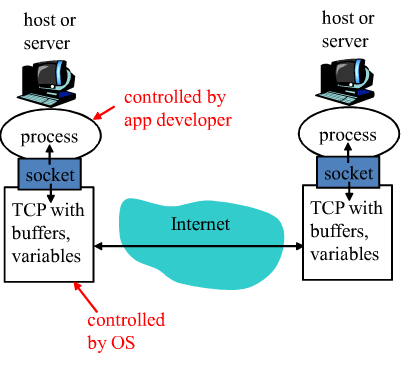
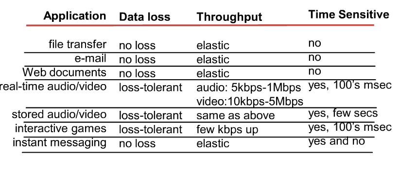
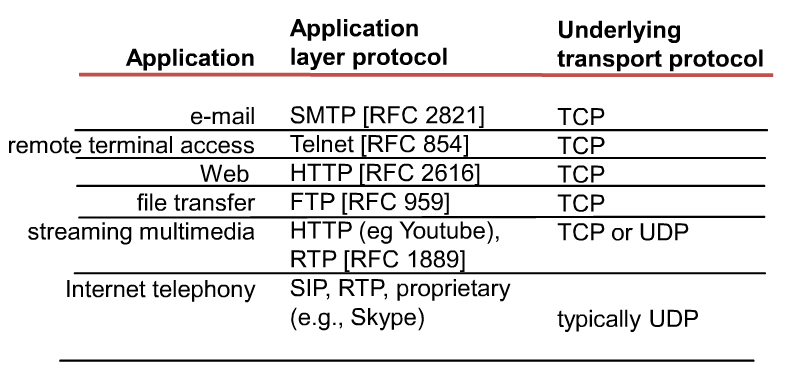

# 2.1 Network applications

목표 : 개념적으로, 구현하는 관점에서 네트워크 어플리케이션 프로토콜에 대해 살펴봄

	1. Transport-layer Service models
	2. client-server paradigm
	3. peer-to-peer paradigm

* 하위 계층은 상위 계층에게 어플리케이션 서비스를 제공하고 상위 계층은 하위 계층의 어플리케이션 서비스를 이용 
* 어플리케이션 계의 하부 계층은 transport-layer 
* 네트워크 어플리케이션은 end system 또는 host에서 실행 됨 

*Creating a network app*

* 프로그램을 write 할 때 서로 다른 end system에서 실행 됨 
* 네트워크를 통해서 서로 주고 받음 
* 네트워크 코어(핵심적으로 있는 것은 라우터) 디바이스 -> 라우터는 네트워크 계층까지만 지원하는 장비
* 따라서, 어플리케이션에서 작성하는 프로그래머는 라우터를 고려하지 않음

*Application 구조*

* Client-server
* Peer-to-peer (P2P)
* 위의 두가지가 섞여있는 Hybrid of client-server and P2P

*Client-Server 방식* 
* ex) Web-browsing, 전자우편
1. Server : 
 * 서비스를 제공하기 위해 항상 켜져있는 컴퓨터 
 * 일반적으로 영구적인(고정 된) IP 주소를 사용 
 * scaling을 위해 server farm이 운영되기도 함 
	- 서버 주소가 하나인 것처럼 보이지만 실제로, 내부적으로는 여러 개가 존재 
	
2. client :
* 서버와 communicate함 
* 항상, 켜져있는 상태는 아님 (간헐적 상태)	
* IP 주소가 변경될 수 있음 
* 클라이언트 끼리 직접 통신을 하지 않음 
	- 항상, 서버를 통해 통신을 함 

*P2P 방식*

* 항상 켜져있는 서버란 개념은 X 
* 중간 과정을 거치지 않고 직접 통신
* IP 주소가 바뀌기도 하며, 항상 연결되어 있는 것은 아님
* 사용자가 굉장히 많이 늘어나도 문제가 없음 (서버가 굉장히 많기 때문)
* 하지만, 관리가 어려움 -> Business model 설립의 어려움 

*Hybrid 방식*
* Skype 
	* voice-over-IP
	* 중앙에 서버가 존재 
	* P2P 연결 : 서버를 통하는게 아닌 직접적으로 연결 
* Instant messaging 
	* Skype와 마찬가지로 중앙에 서버가 존재 ( Ex) 메신저 ) 
	* P2P 형식으로 두 유저가 채팅
	* 연결이 들어오면 중앙 서버에서 IP 주소를 등록
	* 중앙 서버에서 찾은 IP 주소를 통해 유저가 접촉

*Processes communication*

* Process : 실행 중인 프로그램
	* 같은 System인 경우 inter-process-communication을 통해 두 개의 프로세스가 communicate함 ( Ex) Pipe, Shared Memory  )
	* 다른 System인 경우 messages를 교환하며 communicate함 

*Sockets*
* 메세지 교환을 용이하게 하기 위해 만들어져 있는 소프트웨어 유틸리티
* 프로세스는 소켓을 통해 메세지를 주고 받음 
* sockets에는 API가 들어 있음
	* API : 전송할 프로토콜 선택, 몇 개의 파라미터를 수정하는 기능 
* 보내는 프로세스에서는 door에 메세지를 집어넣음
* 따라서, 보내는 프로세스는 하부의 전송구조를 이용해 다른 쪽에 보내게 됨

	

*Addressing processes*
* 무언가를 주고 받기 위해선 주소가 필요함 
* 따라서, 메세지를 받기 위해선 process는 identifier(식별자)가 있어야 함 
	* IP 주소만으론 안됨 : 하나의 host 컴퓨터에는 일반적으로 하나의 IP 주소를 갖지만 프로세스는 하나만 있는게 아니기 때문 
	* 통신의 주체는 Process 즉, Port Number가 필요 
* identifier는 프로세스와 관련 된 IP 주소와 port numbers를 포함함 
	* EX) port numbers : HTTP server : 80
		               Mail server : 25

*App-layer protocol defines*
* Protocol : 보내려고 하는 message의 Type을 정의, Message 문법, Message의 의미, 프로세스가 주고 받는 절차는 어떻게 되있는지를 정의하는 것
* Public-domain protocols  
	* 다른 시스템과 상호동작하기 위해 RFC(인터넷 표준 문서, Request for command)를 정의 
* Proprietary protocols 
	* 표준 절차를 거치지 않고 일반적으로 쓰고있는 protocol

*트랜스포트 서비스는 무엇을 요구할수 있는가 ?*

1. Data loss
	* 데이터를 손실해선 안되는 경우 ( 문서 )
	* 데이터를 손실해도 되는 경우 ( 영상 )
2. Timing
	* Timing에 문제가 있는 경우 ( 전화 )
	* Timing에 문제가 없는 경우 ( File 전송이 느린 경우)
3. Throughput
	- 처리량이 중요한 경우
	- 처리량이 중요하지 않은 경우 
4. Security
	* 보안이 굉장히 중요
	* 보안이 생각보다 중요치 않은 경우  

*Transport service requirements of common apps*

* 이해만 할 것 

*Internet Transport protocols services*
* TCP service 
	* connection-oriented : 연결을 만드는 network, service 질 보장 가능 ( 자원 예약 기능 )  
	* reliable transport : 신뢰성이 있음
	* flow control : 흐름 제어
	* congestion control : 혼잡한 상황 통제 
	* not provide : timing, minumum throughput guarantees, security 
* UDP service :
	 * unreliable : reliable을 보장하지 않음
	 * do not provide flow control, congestion control, timing throughput guarantee, security 

* 인터넷은 성격상(패킷망 위에서 돌고 있는 구조) 안되기 때문에 timing, guarantee, security 제공 불가능

*Internet Apps*

