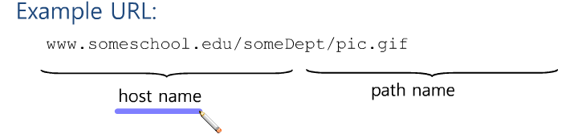
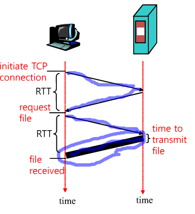
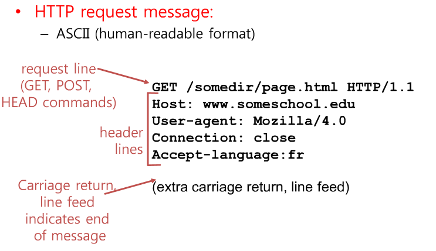
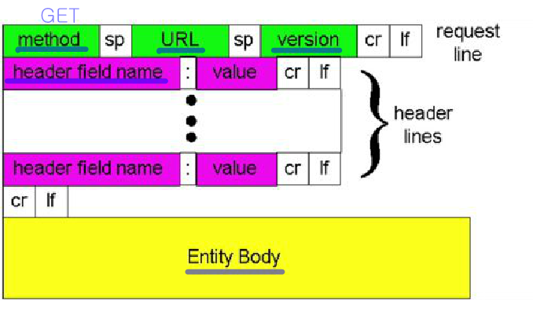
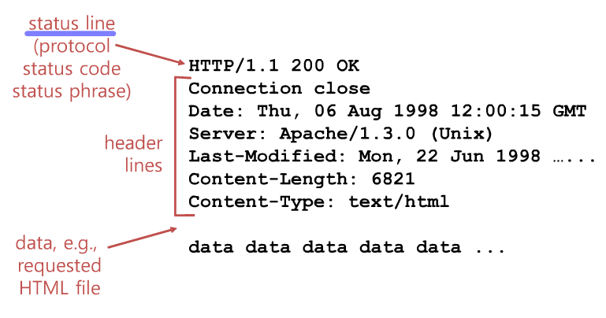
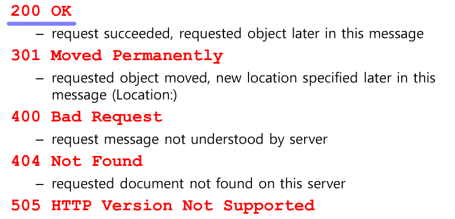

# 2.2 Web and HTTP

* 웹 페이지는 안에 여러 개의 오브젝트를 가지고 있음 
* 오브젝트는 HTML 문서, JPEG 이미지, 자바 애플릿, 오디오 파일 등 다양한 것이 될 수 있음 
* 웹 페이지 들은 기본 HTML File 을 구성하고 있는데 이 파일들은 참조되는 오브젝트로 존재하게 됨
* 각각의 오브젝트 들은 어디에 있는지를 표시하기 위해 URL로 addressable되고 있음  
* URL = Unified Resource Locator 

*HTTP overview*

* HTTP : 웹을 동작시키는 Protocol (hypertext transfer protocol)
* client/server model
	* client - 브라우저가 요청하고 그 결과를 받아 표시해주는 시스템
	* server - 요청에 대한 오브젝트를 보내주는 것 
* TCP 위에서 TCP를 하부 layer로 사용하는 application 서비스
	* TCP는 연결을 설정해서 사용하는 프로토콜 -> 따라서, 클라이언트가 TCP 연결 설정을 요청 , 보통 port 숫자는 80 
	* 그 후, 서버가 TCP 연결 요청을 받음
	* 그 후, HTTP 메세지를 서로 주고 받음 - 클라이언트가 서버에 보내는 메세지, 서버에서 클라이언트에게 답을 주는 메세지
	* 요청에 대한 메세지를 보내고 나면 서버는 TCP 연결을 끊음

* HTTP는 Stateless함 
	* 상태 정보를 갖고 있지 않음 
		* 즉, 어떤 메세지에 대한 응답을 주고 난 후, 다시 그 메세지를 요청하면 전에 보낸 메세지를 기초로 하는게 아닌 순수하게 새로 만들어서 보냄
	* 굉장히 견고하고 안정적임 
	* 하지만, state를 기억하는 방식도 있음 - EX) 쿠키 

*HTTP Connections*

* Persistent (지속적임)
	* 웹사이트를 떠나기 전까지는 connection을 만들어 놓음 
	* 그 후부터, connection을 만드는 과정없이 계속 Data를 주고 받음 

* Nonpersistent (일시적임)
	* 비효율적 ( 메세지를 보낼 떄 마다 새로 만듬 )
	* 하지만, 대부분 하나의 오브젝트는 TCP 연결을 통해 메세지를 보냄

*Nonpersistent HTTP*  
1 - a. 클라이언트가 서버에게 연결 설정을 요청  
1 - b. 서버가 연결해도 좋다고 대답 함  
2. 클라이언트가 원하는 메세지 (Object 목록)를 전달    
3. 결과를 전달  
4. 서버가 TCP 연결을 닫음  
5. 클라이언트는 그 결과물을 표현   
6. 만약, 그런 Object가 10개 더 있다면 1 ~ 5 까지의 과정을 계속 반복  

*NonPersistent HTTP : Response time* 

* 두꺼운 부분 - 데이터량이 많은 경우가 존재 
* Total = 2 Round Trip Time + transmit Time (전체 Data 량)

*Persistent HTTP* 

* 한 번 RTT를 연결 설정하기 위하여 RTT 수행 
* 그 후부터는, Object가 여러개라도 transmit Time명령만 반복 수행 
* 따라서, NonPersistent에 비해 시간 절약이 가능 

*HTTP request message*

* HTTP messages의 두 가지 종류 : request, response 

* HTTP/1.1 => Protocol Version 
* User-Agent => GET하는 브라우저의 소프트웨어 (explore ...)
* Connection => Get operation이 끝난 후 Connection을 끝냄 이 경우는, Nonpersistent한 TCP Connection
* Accept-language => 언어

* (extra carriage return, line feed) => response의 경우 내용물이 여기에 담겨서 들어옴 

* Entity Body => Get의 경우 빈 칸 

*Uploading form input* 

* Post 메소드 (Get말고도 사용할 수 있는 메소드)
	* 사용 시 Input Data가 웹 서버에 등록 됨
	* 서버에서 값을 요청하는 경우 사용하는 메소드 

*Method Type*

1. HTTP/1.0

* GET
* POST - 하나의 field를 채움
* HEAD - GET과 유사, HEADER 정보만 전달 

2. HTTP/1.1

* GET, POST, HEAD
* PUT - 파일 전체를 올릴 수 있음 
* DELETE - 필요하면 웹 서버의 파일을 지울 수 있음   

*HTTP response message* 

* status line - Operation을 실행하고 그 결과에 대해서 설명 

*HTTP response status code* 

* 301 - 자리에 존재 하지 않음

 
